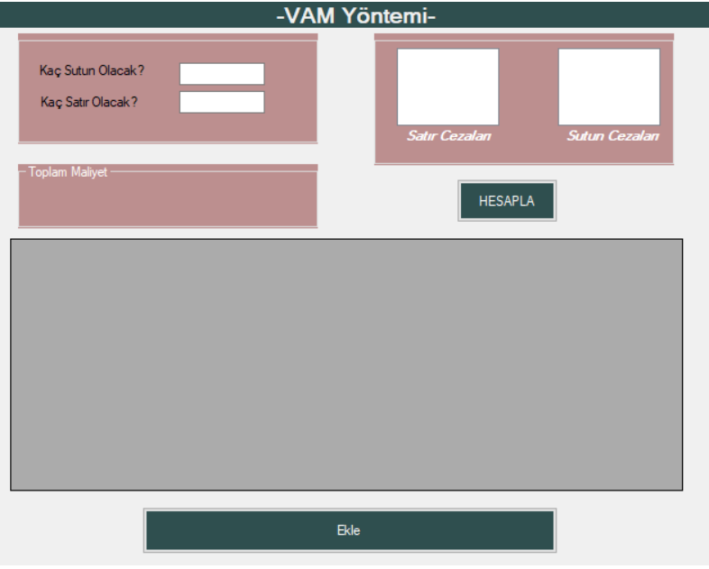
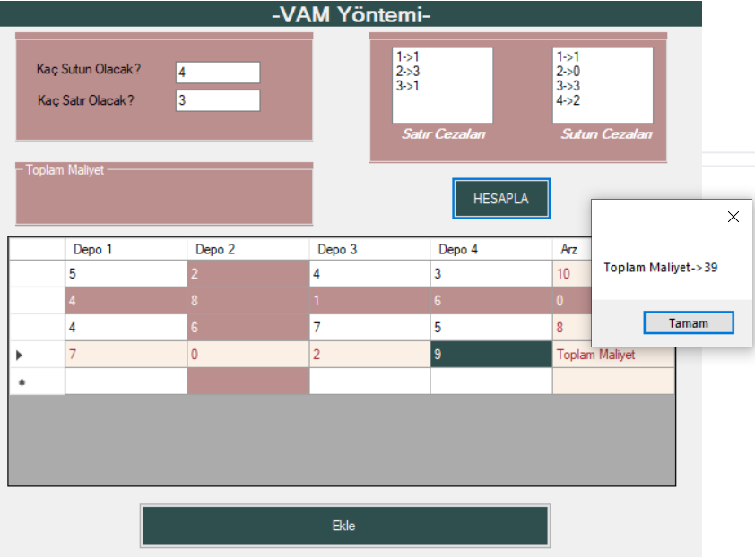
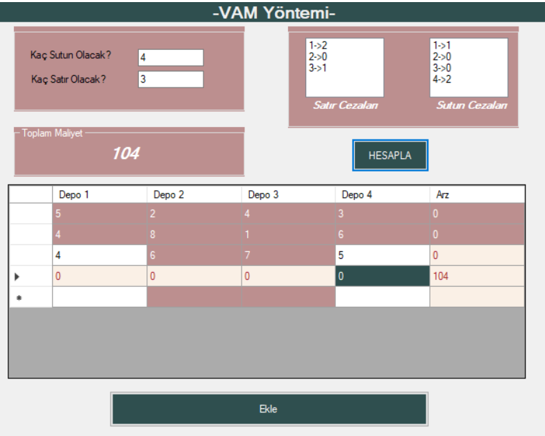

# Bilgeli
[][deneme]
[][deneme]
[][deneme]

### Merhabalar, Ben Bilge  👋

## Kendimi geliştirmeye çalışan bir öğrenciyim!!

### Spotify Playing 🎧

### Benimle iletişim kur:

[][linkedin]
[][instagram]

 

### Programlama Dilleri ve Araçları:

[][linkedin]
[][linkedin]
[][linkedin]
[][linkedin]
[][linkedin]
[][linkedin]
[][linkedin]
[][linkedin]
[][linkedin]
[][linkedin]
[][linkedin]
[][linkedin]
[][linkedin]
[][linkedin]
[][linkedin]
[][linkedin]

 
 

---

➡️ repository'lerimi takip etmeyi unutmayııın

---

  
:zap: GitHub İstatistikleri

  

[website]: https://www.linkedin.com/in/bilgenur-kara/
[instagram]: https://www.instagram.com/bilgenur.kara/?hl=tr
[linkedin]: https://www.linkedin.com/in/bilgenur-kara/

[deneme]: https://www.linkedin.com/in/bilgenur-kara/

